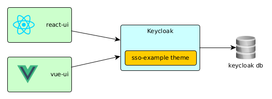

# Simple example of SSO 

Simple project that show a example of Single Sing On with Keycloak and two web app (using react js and vue js), also I define a custom keycloak theme for this project.


## Arquitecture





## Setup


```bash
git clone ....
cd sso-keycloak
```

The first step to can run the demo is a build process of the docker's images and initialize the keycloak server.

```bash
make setup
```

## Use

After the setup process end, three url are available: 
- http//:localhost:8081 access to the react-ui app
- http//:localhost:8082 access to the vue-ui app
- http//:localhost:8080 access to the keycloak server


Users available in the demo:
- demo/demo
- admin/admin


Demo 1: Login

```
Given in a tab access to react-ui
And in another tab access to vue-ui
When select one ui and login
And select the other ui and press F5
Then the second ui was already logged
```

Demo 2: Logout

```
Given in a tab access to react-ui
And in another tab access to vue-ui
And some user is already logged
When select one ui and logout 
And select the other ui and press F5
Then the other ui also the user is logout
```

